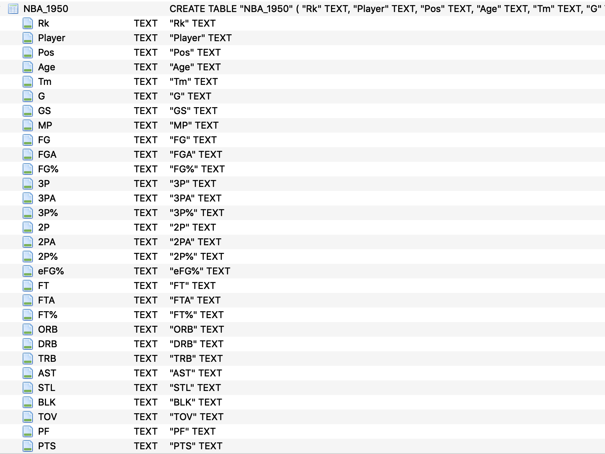
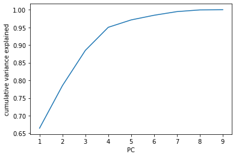
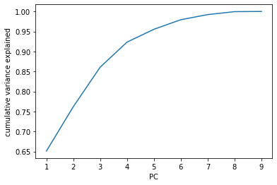
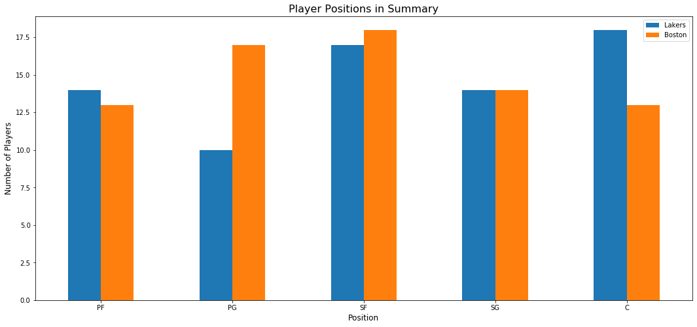
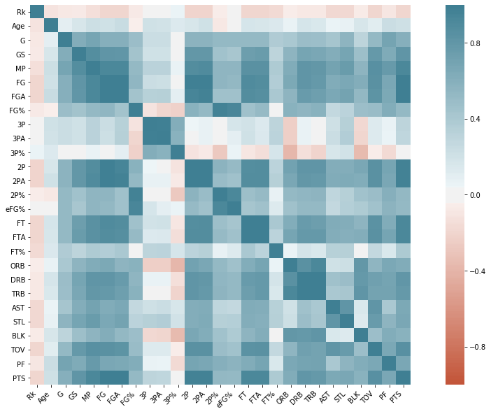
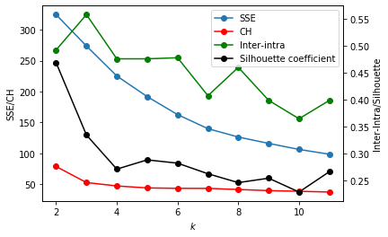
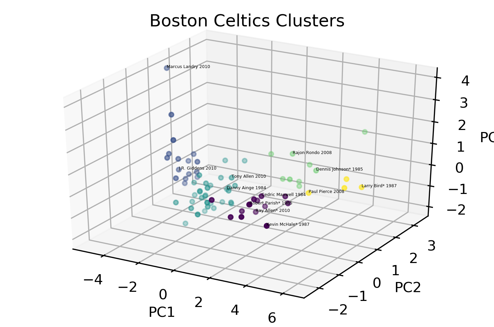
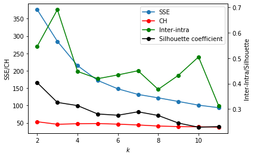
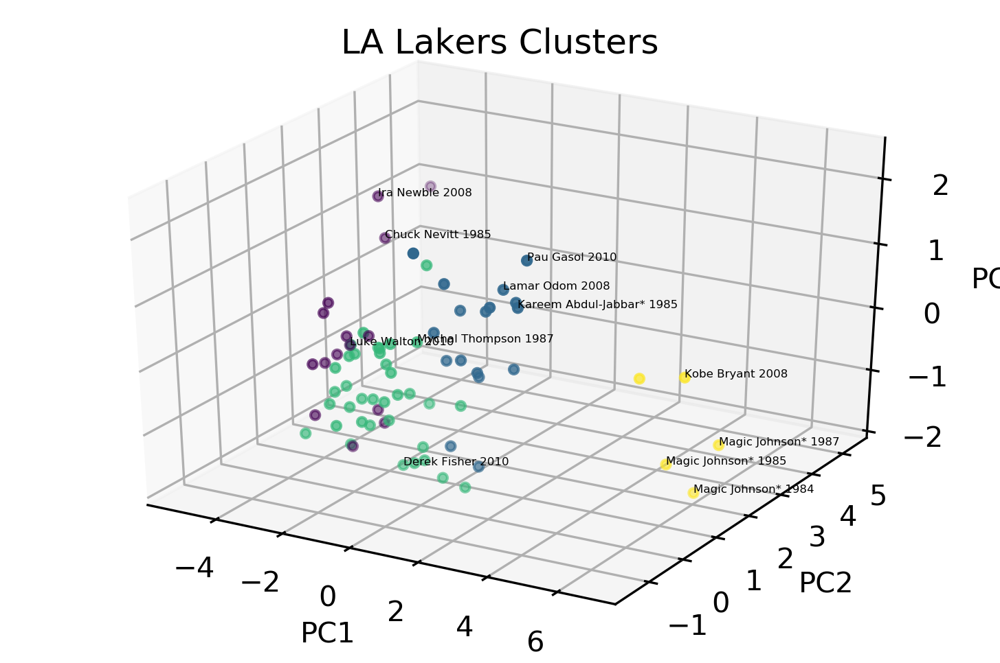

>Boston Celtics vs Los Angeles Lakers (formerly _Minneapolis Lakers_) is considered as the NBA's richest rivalry, existing for more than 60 years. The rivalry was at it's peak in the 1980's when Larry Bird and Magic Johnson were in the NBA league. The two teams have met 12 times in the NBA Finals, Boston winning 9 and the Lakers winning 3.

**The objective of this study is to find clusters within the two NBA teams and provide relevant insights on the strengths and weaknesses of each**.

### The Rivalry: BOS vs LAL

The NBA's most fabled rivalry was born in 1959 when the Celtics beat the Lakers in the Finals. Throughout the 1960's it seemed as if the teams were meeting every year in the finals, and each time Boston was the team celebrating in the end. In 1969, Lakers traded for Wilt Chamberlain, the game's most dominant force at the time, and they were sure that this might be finally the year they beat Boston. Helped by Don Nelson's miracle shot the balloons stayed in the rafters as Boston won again.

15 years later, Larry Bird and Magic Johnson would revive this rivalry. As the 1984 finals begin, Magic looked to end the Boston jinx but Bird has other things in mind. Bird averaged 27 points and 14 rebounds in that particular series as they beat the Lakers. One year later, the Lakers found themselves back in Boston, but this time, LA would make history by becoming the first Laker team to beat Boston. The Boston jinx died at this point and Magic even made a believer in Bird when the Lakers beat the Boston again in 1987.

It took 21 years for the teams to meet again in the finals and in 2008 Boston beat the Lakers for their 17th title. Lakers bagged their 15th title on 2009 beating Orlando 4-1. In 2010 Kobe Bryant and the Lakers beat the Boston for their 16th title. Together, they account for 33 of the 73 NBA championships as of 2019.

Celtics and Lakers met each other in the Finals 12 times during the following seasons: 1959, 1962, 1963, 1965, 1966, 1968, 1969, 1984, 1985, 1987, 2008, 2010.

### Objectives of the study

The main objective of this study is to cluster the players of the two most storied franchises in NBA history, Celtics and Lakers. Players will be clustered based on the similarity of their average statistics on their championship seasons. The study aims to understand what types of players comprises each team and if these findings can identify the strengths and weaknesses of each team against each other.

### Data Collection

The study would involve scraping of NBA player stats from an open online source. Using Python's BeautifulSoup library, data will be scraped from Basketball Reference. Basketball Reference is a website compiling thousands of basketball stats and history statistics, scores, and history for the NBA, ABA, WNBA, and top European competition. This study will only focus on NBA players' statistics. As of July 2019, Basketball Reference lists NBA statistics from 1950 to 2019 seasons.

**Scraping and Storing Data**

Using Python's BeautifulSoup library, data was scraped from Basketball Reference. Beautiful Soup is a Python library for pulling data out of HTML and XML files. The data was scraped last **July 20, 2019**.  

The first step to scraping is by inspecting the actual website and using HTML tags to get the data needed. Using the `lxml` parser, the desired data in the form of raw HTML text was deserialized into Python object, which can be converted to usable format such as string or dataframe.

The table below shows a sample of the scraped data.

<table border="1" class="dataframe">
  <thead>
    <tr style="text-align: right;">
      <th></th>
      <th>Rk</th>
      <th>Player</th>
      <th>Pos</th>
      <th>Age</th>
      <th>Tm</th>
      <th>G</th>
      <th>GS</th>
      <th>MP</th>
      <th>FG</th>
      <th>FGA</th>
      <th>...</th>
      <th>FT%</th>
      <th>ORB</th>
      <th>DRB</th>
      <th>TRB</th>
      <th>AST</th>
      <th>STL</th>
      <th>BLK</th>
      <th>TOV</th>
      <th>PF</th>
      <th>PTS</th>
    </tr>
  </thead>
  <tbody>
    <tr>
      <th>0</th>
      <td>1</td>
      <td>Álex Abrines</td>
      <td>SG</td>
      <td>25</td>
      <td>OKC</td>
      <td>31</td>
      <td>2</td>
      <td>19.0</td>
      <td>1.8</td>
      <td>5.1</td>
      <td>...</td>
      <td>.923</td>
      <td>0.2</td>
      <td>1.4</td>
      <td>1.5</td>
      <td>0.6</td>
      <td>0.5</td>
      <td>0.2</td>
      <td>0.5</td>
      <td>1.7</td>
      <td>5.3</td>
    </tr>
    <tr>
      <th>1</th>
      <td>2</td>
      <td>Quincy Acy</td>
      <td>PF</td>
      <td>28</td>
      <td>PHO</td>
      <td>10</td>
      <td>0</td>
      <td>12.3</td>
      <td>0.4</td>
      <td>1.8</td>
      <td>...</td>
      <td>.700</td>
      <td>0.3</td>
      <td>2.2</td>
      <td>2.5</td>
      <td>0.8</td>
      <td>0.1</td>
      <td>0.4</td>
      <td>0.4</td>
      <td>2.4</td>
      <td>1.7</td>
    </tr>
    <tr>
      <th>2</th>
      <td>3</td>
      <td>Jaylen Adams</td>
      <td>PG</td>
      <td>22</td>
      <td>ATL</td>
      <td>34</td>
      <td>1</td>
      <td>12.6</td>
      <td>1.1</td>
      <td>3.2</td>
      <td>...</td>
      <td>.778</td>
      <td>0.3</td>
      <td>1.4</td>
      <td>1.8</td>
      <td>1.9</td>
      <td>0.4</td>
      <td>0.1</td>
      <td>0.8</td>
      <td>1.3</td>
      <td>3.2</td>
    </tr>
    <tr>
      <th>3</th>
      <td>4</td>
      <td>Steven Adams</td>
      <td>C</td>
      <td>25</td>
      <td>OKC</td>
      <td>80</td>
      <td>80</td>
      <td>33.4</td>
      <td>6.0</td>
      <td>10.1</td>
      <td>...</td>
      <td>.500</td>
      <td>4.9</td>
      <td>4.6</td>
      <td>9.5</td>
      <td>1.6</td>
      <td>1.5</td>
      <td>1.0</td>
      <td>1.7</td>
      <td>2.6</td>
      <td>13.9</td>
    </tr>
    <tr>
      <th>4</th>
      <td>5</td>
      <td>Bam Adebayo</td>
      <td>C</td>
      <td>21</td>
      <td>MIA</td>
      <td>82</td>
      <td>28</td>
      <td>23.3</td>
      <td>3.4</td>
      <td>5.9</td>
      <td>...</td>
      <td>.735</td>
      <td>2.0</td>
      <td>5.3</td>
      <td>7.3</td>
      <td>2.2</td>
      <td>0.9</td>
      <td>0.8</td>
      <td>1.5</td>
      <td>2.5</td>
      <td>8.9</td>
    </tr>
  </tbody>
</table>

5 rows × 30 columns

### Data Storage

After the data has been extracted from the website, each dataframe will be collected and stored into a SQL Database using `sqlite3` - a lightweight disk-based database library for python.

A total of 50 tables were obtained after scraping and were stored in the database. The schema of the database is shown below.

### Data Description

These statistics are the average statistics of players per game in a season. In a single season, there are 30 different statistics per player.

`Rk`: Rank - alphabetical ranking of player in the season

`Pos`: Position - player's playing position

`Age`: Age - age at the start of February 1st of that season

`Tm`: Team - team the player played for

`G`: Games - number of games the player played for that season

`GS`: Games Started - number of games the player started a game

`MP`: Minutes Played Per Game - average playing time per game

`FG`: Field Goals Per Game - average number of made shots

`FGA`: Field Goal Attempts Per Game - average number of shot attempts

`FG%`: Field Goal Percentage - shots made over shot attempts percentage

`3P`: 3-Point Field Goals Per Game - average number of 3-Pointers made

`3PA`: 3-Point Field Goal Attempts Per Game - average number of 3-Point attempts

`3P%`: FG% on 3-Pt FGAs. - 3-Pointers made over 3-Point attempts percentage

`2P`: 2-Point Field Goals Per Game - average number of 2-Point shots made

`2PA`: 2-Point Field Goal Attempts Per Game - average number of 2-Point shot attempts

`2P%`: FG% on 2-Pt FGAs. - made 2-Point shots over 2-Point attempts percentage

`eFG%`: Effective Field Goal Percentage - this statistic adjusts for the fact that a 3-point field goal is worth one more point than a 2-point field goal

`FT`: Free Throws Per Game - average number of free throws made

`FTA`: Free Throw Attempts Per Game - average number of free throw attempts

`FT%`: Free Throw Percentage - free throw made over free throw attempts percentage

`ORB`: Offensive Rebounds Per Game - average number of offensive rebounds

`DRB`: Defensive Rebounds Per Game - average number of defensive rebounds

`TRB`: Total Rebounds Per Game - average total rebounds

`AST`: Assists Per Game - average number of assists

`STL`: Steals Per Game - average number of steals

`BLK`: Blocks Per Game - average number of blocks

`TOV`: Turnovers Per Game - average number of turnovers

`PF`: Personal Fouls Per Game - average number of fouls

`PTS`: Points Per Game - average points per game

Not all of these features will be used as some are derived from the others. This will be discussed in detail in the Feature Selection section.

### Pre-filtering and Wrangling

Boston and Lakers faced each other in the finals for a total 12 times in seasons 1959, 1962, 1963, 1965, 1966, 1968, 1969, 1984, 1985, 1987, 2008, 2010 of the NBA. However, some statistics relevant to this study were not part of some earlier seasons. **Steals** and **blocks** were first recorded in 1974, **turnovers** in 1978 and **3-Point** shots in 1980. Due to these limitations, the dataset was sub-setted such that all the mentioned statistics are available. The resulting dataset is now composed of statistics from years 1984, 1985, 1987, 20018 and 2010.

### Feature Selection

Only the major offensive and defensive statistics will be considered for this study. Statistics like the number of games played and number of games started were dropped as they are not offensive and defensive statistics. FG, FGA, FG%, 2-Point and 3-Point statistics were also removed, they will be represented by **eFG%** which is the effective field goal percentage. eFG% takes into account that 3-Point shot is worth one more than 2-Pointers.

The features selected for clustering are PTS, AST, STL, TOV, TRB, FT, FTA, FT% and eFG%.

### Normalization

`sklearn.preprocessing.StandardScaler` was used to normalized the data, it transform each value $x$ to their $z$-score,

$$z = \frac{x-\bar x}{\sigma},$$

where $\bar x$ is the mean of that feature and $\sigma$ is the standard deviation of that feature. After this normalization, all features would have a mean of 0 and a standard deviation of 1.     

### Dimensionality Reduction using PCA

To reduce the number of dimensions such that it still explain the variance of the dataset, a dimensionality reduction method, Principal component analysis (PCA), will be used. PCA is a statistical procedure that uses an orthogonal transformation to convert a set of observations of possibly correlated variables (entities each of which takes on various numerical values) into a set of values of linearly uncorrelated variables called principal components (PC).

The number of PC will be set to 3 for both teams. The reason for such is that it is easier to visualize plots with 3 dimensions or less, choosing 4 will give us higher variance but will be hard to interpret visually. Scree plots below will show the variance if we choose 3 PCs. We will do this step for each team.

**Boston PCA**

3 PCs will be able to explain almost 90% of the variance. The weight of the features in each PC will explain more what's inside a PC. Shown below are the weights of player statistics contained in the PCs.

<table border="1" class="dataframe">
  <thead>
    <tr style="text-align: right;">
      <th></th>
      <th>PTS</th>
      <th>AST</th>
      <th>STL</th>
      <th>TOV</th>
      <th>TRB</th>
      <th>FT</th>
      <th>FTA</th>
      <th>FT%</th>
      <th>eFG%</th>
    </tr>
  </thead>
  <tbody>
    <tr>
      <th>PC-1</th>
      <td>0.394597</td>
      <td>0.312026</td>
      <td>0.312805</td>
      <td>0.383944</td>
      <td>0.343619</td>
      <td>0.381633</td>
      <td>0.379088</td>
      <td>0.186917</td>
      <td>0.243536</td>
    </tr>
    <tr>
      <th>PC-2</th>
      <td>-0.080998</td>
      <td>0.559078</td>
      <td>0.546685</td>
      <td>0.091906</td>
      <td>-0.362010</td>
      <td>-0.185141</td>
      <td>-0.228444</td>
      <td>0.127851</td>
      <td>-0.373763</td>
    </tr>
    <tr>
      <th>PC-3</th>
      <td>0.059723</td>
      <td>0.114056</td>
      <td>0.002067</td>
      <td>0.208019</td>
      <td>0.190815</td>
      <td>0.032295</td>
      <td>0.080272</td>
      <td>-0.883454</td>
      <td>-0.340235</td>
    </tr>
  </tbody>
</table>

- **PC-1** seems to be dominated by many features including PTS, AST, STL, TOV, TRB, FT, FTA, FT%. Players with high positive PC-1 value are more likely to be highly-utilized players who plays heavy minutes for the team.

- **PC-2** is dominated by AST and STL, players with high positive PC-2 value are more likely to be point guards who does not focus much on the scoring but rather focuses in making plays and sparking fastbreaks.

- **PC-3** is only weighted by FT% and not much on other statistics. Players with high positive PC-3 value are more likely to have low playing time. Low playing time yields low statistics and higher chances of getting high free throw percentage.

**Los Angeles PCA**

For Los Angeles, 3 PCs will explain approximately 85% of the variance.

<table border="1" class="dataframe">
  <thead>
    <tr style="text-align: right;">
      <th></th>
      <th>PTS</th>
      <th>AST</th>
      <th>STL</th>
      <th>TOV</th>
      <th>TRB</th>
      <th>FT</th>
      <th>FTA</th>
      <th>FT%</th>
      <th>eFG%</th>
    </tr>
  </thead>
  <tbody>
    <tr>
      <th>PC-1</th>
      <td>0.385594</td>
      <td>0.329553</td>
      <td>0.334589</td>
      <td>0.376426</td>
      <td>0.299354</td>
      <td>0.387214</td>
      <td>0.387381</td>
      <td>0.215164</td>
      <td>0.230560</td>
    </tr>
    <tr>
      <th>PC-2</th>
      <td>0.009765</td>
      <td>0.298461</td>
      <td>0.115711</td>
      <td>0.218095</td>
      <td>-0.114437</td>
      <td>0.130739</td>
      <td>0.112950</td>
      <td>-0.586003</td>
      <td>-0.680827</td>
    </tr>
    <tr>
      <th>PC-3</th>
      <td>0.144373</td>
      <td>-0.379611</td>
      <td>-0.413548</td>
      <td>-0.023781</td>
      <td>0.589668</td>
      <td>0.102875</td>
      <td>0.194701</td>
      <td>-0.497875</td>
      <td>0.139228</td>
    </tr>
  </tbody>
</table>

- **PC-1** seems to be dominated by many features including PTS, AST, STL, TOV, TRB, FT, FTA, FT%. Players with high positive PC-1 value are more likely to be highly-utilized players who plays heavy minutes for the team.

- **PC-2** is only weighted by FT% and not much on other statistics. Players with high positive PC-2 value are more likely to have low playing time. Low playing time yields low statistics and higher chances of getting high free throw percentage.

- **PC-3** is dominated by AST, STL, TRB and FT%, players with high positive PC-3 value are more likely to be forwards who does not focus much on scoring but rather in team plays, defense and rebounding.

### Exploratory Data Analysis

In a team of players, only 5 distinct positions are played by the players namely, Center (C), Power Forward (PF), Small Forward (SF), Shooting Guard (SG) and Point Guard (PG). From the figure generated below, we can have an initial insight on the strengths of each team. Boston Celtics outnumbered LA Lakers in terms of the number of Point Guards and Shooting Forwards. On the other hand, LA Lakers outnumbered the Celtics in terms of big men acting as Centers and Power Forwards.

Looking at these results, the rivalry between the two teams can be compared to the story of David and Goliath.

Relationships of each features was plotted using pair plots. It can be observed from the figure that the minutes played (`MP`) is highly correlated to all statistics. Including it as a feature variable will result to multicollinearity.

Another observation is the Field Goals (FG) is highly correlated to 2-point and 3-point field goals. Again, including all these variables would result to multicollinearity thus, only `eFG%` was considered as feature to be used to account that 3-point shot is worth 1 more than 2-point shot.

### Clustering using K-Means 

K-Means algorithm was chosen as the clustering algorithm since it generates tighter clusters	compared to hierarchical clustering, aside from being the simplest and fastest to implement. The algorithm is also versatile that can it be used for any type of clustering.

The algorithm works iteratively to assign each data point to one of k groups based on the features provided. As a result, data points are clustered based on centroids of the clusters.

K-Means uses iterative refinement to produce a final result until a stopping criteria is met such as no data points change clusters or the sum of the distances is minimized. Since the algorithm starts with initial random estimates of centroids, initial seeding has a strong impact on the final results. To avoid randomness in the result, additional parameter was used to retain the intial seeds which can be done by setting the `random_state` parameter of k-Means using `sklearn`.

- `random_state` - given kmeans' iterative nature and the random initialization of centroids at the start of the algorithm, randomness was set to be deterministic by specifying an integer.

**Choosing k**

Internal validation criteria were used to find the optimal number of cluster since we are not relying on ground truth values to evaluate the quality of the clustering. The following are the desired characteristics of a good cluster:

* **Compact**: points in the same cluster should be close together
* **Separated**: points not belonging in the cluster should be far from points in the cluster
* **Balanced**: the number of points in each cluster are comparable
* **Parsimonious**: the number of cluster should be as few as possible

Plots of Sum of squares distances to centroids, Calinski-Harabasz index, Intracluster to intercluster distance ratio, Silhouette coefficient were generated to assess the optimal values of k.

- In the **SSE** plot, the point of inflection, where the rate of decrease sharply shifts, suggests the optimal k.
- For the **CH** plot, high value is desired since it will indicate that the clusters are more defined.
- For the **Intra-Inter** ratio, small values of this measure indicate better clustering behavior.
- For the **Silhouette Coefficient**, large positive values indicate highly separated clustering, and negative values are indicative of some level of “mixing” of data points from different clusters.

### Boston Clustering

**Choosing k for Boston Celtics**

Based on the validation criteria plot above, **k=5** is the optimal number of clusters for this data.

**Cluster 1 - The Role Players**  The first cluster are represented as violet dots in the 3D scatter plot above, these players lie in both PC1 and PC2. These players are the highly-utilized and playmakers. Cedric Maxwell, the 1981 MVP does not score much but is a good rebounder and an efficient overall player. Players like Kevin McHale, Kevin Garnett and Ray Allen are known role players for Boston. McHale was a heavy scorer and rebounder especially during 1987. Garnett and Allen were instrumental in their 2008 championship season.

**Cluster 2 - Benchwarmers** The second cluster (blue dots) were composed of under-utilized players bench players. It's hard to say that they are low-performing players, it could be that they lack playing time. One notable player in this cluster is Brian Scalabrine which was once dubbed as "White Mamba" (Kobe Bryant's nickname was Black Mamba).

**Cluster 3 - The Backups** The third cluster (bluegreen dots) is composed of players which lies in the negative side of PC-1 which means they are not highly-utilized nor playing heavy minutes. Players like Tony Allen, Nate Robinson and Danny Ainge are bench players who play significant amount of time. Most of the players in this cluster are highly efficient back-ups, getting high output in a short amount of playing time.

**Cluster 4 - The Playmakers** The fourth cluster (green dots) lies in the positive end of PC2 which means they don't score heavily but contributes a lot to the team. Notable players from this cluster are Rajon Rondo and Dennis Johnson. Rondo, in 2010, was in his prime and almost averaged double figures in assists. Dennis Johnson, in 1985, is scoring, assisting and rebounding well unfortunately Lakers won the championship that year.

**Cluster 5 - Superstar Cluster** Celtics greats Larry Bird and Paul Pierce both led Boston to a championship. They both are so good they earned they own cluster (yellow dots). They have heavy load when it comes to scoring and assisting.

### Los Angeles Clustering

**Choosing k for LA Lakers**

Based on the validation plot above, **k=4** is the optimal number of clusters for this data.

**Cluster 1 - Benchwarmers** The first cluster, represented as violet dots in the 3D scatter plot above, lie in the negative side of PC-1 which means they are the opposite of the highly-utilized players. These are composed of low output players. One notable Laker in this cluster is Luke Walton who was vital in some of Lakers' championship run in the Kobe era. In 2010, Walton is playing less minutes.

**Cluster 2 - Scoring Big Men** The second cluster, blue dots, lie in the high positive end of PC2 and positive end of PC1. Players in this cluster like Pau Gasol, Lamar Odom and Kareem Abdul-Jabbar are scoring big men. Gasol and Odom are Kobe's sidekicks in their championship runs including the one in 2010 when they beat Boston. Kareem patented the 'sky hook', dubbed as the most unstoppoble shot in the NBA, is a scoring and rebounding player with high field goal and free throw percentage.

**Cluster 3 - The Role Players** The third cluster (bluegreen dots) is composed of players which lies in the negative side of PC1. These players are scoring lightly for team but are highly efficient. Derek Fisher, Metta World Peace (aka Ron Artest), and Sasha Vujacic all played with Kobe when they won the 2010 championship. These players though not scoring heavily are role players and bench players which plays important minute in the Lakers rotation. Mychal Thompson, the 1978 first overall pick, plays as Kareem's back up and Kevin McHale's (one of Boston great and NBA Hall of Famer) defender.

**Cluster 4 - Superstar Cluster** Two of the greatest Lakers, Magic Johnson and Kobe Bryant, earned they own cluster. Magic was one of the first tall point guards in the NBA who can score and assist well. Kobe was more of the scoring focal point in his era.

### Conclusion

The results found clusters which appeared for both teams, it also gave clusters that are unique to the franchise.

Both Boston and LA have Superstar, Role Players, and Benchwarmers clusters. Superstars are so good they earned they owned clusters, Role Players act as a support to the superstar.

Boston's other two clusters are Backups and Playmakers. Backups who play significant minutes as substitutes to the starting players, Playmakers are unselfish playmaking guards.

LA have a unique cluster of Scoring Big Men which include Hall of Famer Kareem Abdul-Jabbar, Pau Gasol, and Lamar Odom.

### Recommendations

To further improve the results of the study, the following recommendations are suggested:

- Design an imputation method which will cover some statistics that were not recorded in the earlier seasons. This will enable the study to expand on all 12 seasons of their rivalry

- Expand the features by including statistics like assist-to-turnover ratio which measures how careful or careless a player is with the ball on offense

- Expand the study by including data which shows the performance of Celtics and Lakers against other teams. This will unravel whether or not the teams play differently when playing against their rival.

### References

[1] [Assessing NBA player similarity with Machine Learning (R)](https://towardsdatascience.com/which-nba-players-are-most-similar-machine-learning-provides-the-answers-r-project-b903f9b2fe1f)

[2] [Defining NBA players by role with k-means clustering](https://dribbleanalytics.blog/2019/04/positional-clustering/) 

[3] [Basketball Reference](https://www.basketball-reference.com/)  

[4] [Introduction to K-means Clustering](https://www.datascience.com/blog/k-means-clustering)  

[5] [Sanini, M.(2016). ML4LT: Machine Learning for Language Technology notes [PDF slides]](http://santini.se/teaching/ml/2016/Lect_10/10c_UnsupervisedMethods.pdf)

[6] [“Boston Celtics vs Los Angeles Lakers: The NBA's Richest Rivalry.”](www.skysports.com/nba/news/36244/11630036/boston-celtics-vs-los-angeles-lakers-the-nbas-richest-rivalry) Sky Sports, 9 Mar. 2019, 18:20

### Final Notes

This project was co-authored by [Rosely Peña](linkedin.com/in/roselydpena) as part of our requirements in MS in Data Science's Data Mining and Wrangling course. If you wish to have a copy of the data and the code used in this project, you may send me a message via [Linked in](https://www.linkedin.com/in/conolcedric).