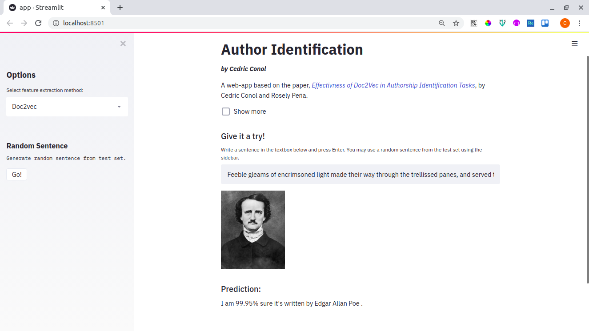

Authors: Cedric Conol, Rosely Peña

#### Check out the web application [here](https://github.com/cedricconol/author-identification)!

### Abstract

In this study, we show how doc2Vec can improve the accuracy of classifiers for
authorship identification tasks. Doc2vec, which is heavily based on word2vec, was
used to represent the documents as vectors to capture stylometric features to
identify the writing style of an author. Here, doc2vec will represent documents of
any length into a fixed-length vector specified. Two datasets were used in this
experiment, PAN 2012 and Spooky Author Identification. The former has 8
authors, each with 2 training document and 1 test document; the latter has 3
authors with documents chunked into sentences resulting to 13, 705 training
instances and 5, 874 testing instances. The results show improvements in the
classifier accuracy by as much as 12.5 percentage points using Logistic
Regression as compared to other related work and 25 percentage points as
compared to using Bag-of-Words (BoW) and TF-IDF (Term Frequency – Inverse
Document Frequency) vector representations.

*Note: If you wish to have a copy of the data and the code used in this project, you may send me a message via [Linked in](https://www.linkedin.com/in/conolcedric).*